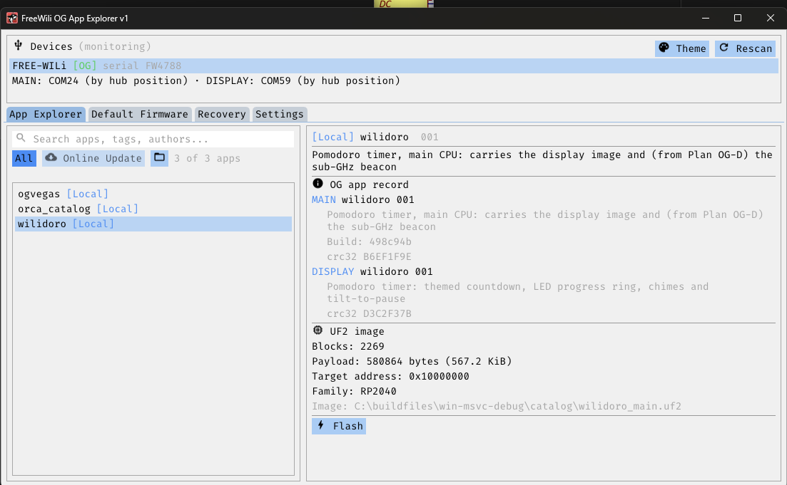

# FreeWili OG App Explorer

**A single-executable desktop app for loading OG apps onto the FreeWili 1-OG.**

An OG app ships as one `<name>_main.uf2`. You pick it, you press Flash, and both
CPUs end up running it — the app finds the board, works out which RP2040 it is
talking to, and writes to the right one. No drag-and-drop into `RPI-RP2`, no
guessing which of the two identical mass-storage volumes is MAIN and which is
DISPLAY.



## ⚠️ First: the board needs the OG display bootloader

**OG apps will not work without it.** An OG app's display half is *embedded
inside the main UF2* and travels to the DISPLAY CPU over the inter-CPU link —
and the OG display bootloader is the thing on the other end that receives it.
On a board that does not have it, flashing an OG app leaves you with a MAIN CPU
running the app and **a display that never comes up**.

It is a one-time, per-board install, and this app does it for you:

> **Default Firmware tab → "FreeWili 1-OG Display Bootloader"**

Do that once. After that, every OG app is a single file and a single click.

Two things worth knowing:

- Installing the bootloader **erases the MAIN CPU first**. That is deliberate, not
  collateral: a running MAIN app talks continuously on the inter-CPU link, and
  the DISPLAY bootloader's console only enumerates after ~10 seconds of MAIN
  silence. It also leaves the board wanting an app, which is the next thing you
  flash.
- Installing the **original (deprecated) FreeWili 1 firmware removes the display
  bootloader again.** Coming back to OG apps means reinstalling it from the same
  tab.

The app warns you about this at flash time rather than assuming — it cannot
prove a bootloader's absence without interrogating the board, and a false
refusal would be worse than a false warning.

## Download

**[Download FwOGExplorerV1.zip →](https://github.com/freewili/fwOGAppExplorer/releases/latest)**

Windows x64. Unzip and run `fwOGExp.exe` — one statically linked executable with
the firmware images baked in, so there is nothing to install and no
redistributable to chase. The `catalog/` folder beside it holds a few sample app
UF2s; the App Explorer tab picks up anything dropped in there.

**Linux** works and has flashed a real board, but there is no prebuilt download
— build it from source, and read [Linux](#linux) first: it needs a few
development packages, it has one shared-library dependency Windows does not, and
serial-port permissions usually need a one-time setup step.

## What it does

| Tab | Purpose |
|---|---|
| **App Explorer** | **The main event: load OG apps.** Browse the catalog — embedded, a local `catalog/` folder, or a remote `apps.json` URL — and flash any app in one click. Requires the display bootloader (above). |
| **Default Firmware** | **Install the OG display bootloader here first.** Also restores the original (deprecated) FreeWili 1 firmware, or erases either CPU. |
| **Recovery** | Documentation for getting a board back when it will not enumerate. |
| **Settings** | Theme, remote catalog URL, window state. |

The parts that make it more than a file copier:

- **The two CPUs are told apart.** In BOOTSEL both MAIN and DISPLAY present an
  identical `RPI-RP2` volume, and writing an app to the wrong one is not a
  recoverable mistake on every board. The app resolves the ambiguity from serial
  enumeration where it can, and where it cannot it flashes a tiny probe image
  that reports which CPU it woke up on. See [`probe/README.md`](probe/README.md).
- **Flash plans, not single writes.** Installing the display bootloader means
  erasing MAIN first (a running MAIN keeps DISPLAY's bootloader console from ever
  enumerating), then writing DISPLAY. That ordering is data in
  `firmware/manifest.json`, not scattered through the UI.
- **Catalog entries declare their target CPU**, and the flash scheme is what
  decides which CPU an entry can reach — a `DisplayBootloader` entry cannot
  address MAIN even if it asks to.
- **UF2s describe themselves.** A FwOGapp image carries its own name, version,
  description and build identity, so dropping an unknown `.uf2` into `catalog/`
  shows you what it is and what it will do to both CPUs — with nothing
  downloaded and no catalog entry written. See below.
- **It flashes from whatever state the board is in.** Both CPUs running, either
  or both sitting in `RPI-RP2` (by button, by an earlier flash, or because a CPU
  is blank), the display running only its bootloader, the original firmware
  installed — every state was exercised on hardware. Each CPU is written by its
  position on the board's own USB hub, the board is re-identified live at every
  step of a plan, and a CPU that is mid-reboot is waited for rather than
  refused. Before a MAIN install the DISPLAY is parked in BOOTSEL so a running
  display app cannot disturb the write; the new MAIN firmware brings it back.
- **The board does not need a serial number.** A FreeWili OG under OG firmware
  never enumerates its FTDI, so its serial reads `Unknown` for life; the app
  tells boards apart by the RP2040 chip ids their serial ports report, and only
  refuses when a board *contradicts* the one it was working with.

## Command line

`fwogcli.exe` sits beside the GUI and drives the identical flash engine:

```
fwogcli list                                  every connected board and its CPUs
fwogcli flash <file.uf2> [--cpu main|display] flash a UF2 (default: MAIN)
fwogcli install <slug>                        an embedded entry's plan (see `entries`)
fwogcli entries                               the embedded entries and their plans
fwogcli info <file.uf2>                       what a UF2 says about itself
fwogcli bootsel main|display                  reboot a running CPU into BOOTSEL
   --device <n|serial|chip>  pick a board when several are connected
   --keep-display            do not park the DISPLAY before a MAIN install
   --yes                     confirm a drive the engine cannot place by hub port
```

Exit codes: 0 ok, 1 flash failed, 2 usage/selection, 3 needs `--yes`.

## The FwOGapp Contract

Firmware for the FreeWili OG follows the **FwOGapp Contract**, a set of seven
build-enforced rules defined in the BSP
([`AGENTS.md` in wiliOGBsp](https://github.com/freewili/wiliOGBsp/blob/main/AGENTS.md)).
The point of it is that an OG image is identifiable, versioned, self-describing
and recoverable without anyone opening the case. In short:

| # | Rule | Enforced by |
|---|---|---|
| 1 | Every app declares a three-digit `VERSION` and a `DESCRIPTION` | configure error |
| 2 | DISPLAY apps declare a power policy — `FWOG_POWER_DEFAULT()` or `FWOG_POWER_CUSTOM()`; the default handles the 6-second red-button shutdown hold | link error |
| 3 | 1200-baud USB BOOTSEL must not be built away — the DISPLAY CPU has no BOOTSEL button, so this is its only way back | configure error |
| 4 | The FPGA bitstream SHA-256 is pinned | automated test |
| 5 | USB identity is declared: VID/PID `093C:2054` (MAIN) / `093C:2055` (DISPLAY), product string `FWOG <cpu> <name> <version>` | build-time check |
| 6 | Every image embeds an `fwog_uf2_info_t` metadata record — magic, name, description, version, CRC | build-time check |
| 7 | MAIN apps declare a watchdog policy; the default kicks an 8.3-second hardware watchdog each loop | link error |

**Rules 5 and 6 are what this app reads.** Rule 5's `FWOG main ` / `FWOG display `
product-string prefix is one of the signals that identifies a connected board
down to which CPU it is, before anything is written — second in line behind USB
hub port location, which is authoritative, and ahead of the probe image as a
last resort. Rule 6's record is how an image explains itself: a MAIN UF2 carries
*two* records — its own, plus one describing the DISPLAY image embedded inside
it — which is what lets a single `<name>_main.uf2` be shown, and flashed, as the
one file that provisions both CPUs.

That second record is also the clearest statement of why the display bootloader
is a prerequisite rather than a nicety: the DISPLAY image genuinely is inside the
MAIN UF2, and the bootloader is what unpacks it across the link. It decides
whether to transfer by comparing CRC32, which is why a display record carries no
build identity of its own — there is nothing for it to disagree with. With no
bootloader on the board, nothing ever reads that record and the DISPLAY CPU
keeps whatever it had.

One caveat worth stating plainly: the record layout this app parses was
**derived from real images rather than from a published header** (see
[`src/catalog/fwOgAppInfo.h`](src/catalog/fwOgAppInfo.h), which documents the
offsets and the evidence). Every field is bounds-checked and a record that does
not fit is rejected rather than read past.

## Firmware for the board itself

The RP2040-side firmware — the display bootloader, the CPU prober this app
embeds, and the OG board support package — lives in the BSP repo:

**[github.com/freewili/wiliOGBsp](https://github.com/freewili/wiliOGBsp)**

## Building from source

Requires CMake 3.28+, Ninja, and a C++23 compiler. SDL3, Dear ImGui,
nlohmann/json, doctest and `freewili-finder` are fetched automatically by CMake.
On Windows nothing else needs to be installed by hand; on Linux a handful of
development packages do — see [Linux](#linux).

```sh
cmake --preset win-msvc-release
cmake --build --preset win-msvc-release
```

Output lands in `build/win-msvc-release/`. On Windows, run this from a shell
with the MSVC environment loaded (the "x64 Native Tools Command Prompt") — the
preset fails loudly rather than silently falling back to a GCC on `PATH`.

Presets: `win-msvc-debug`, `win-msvc-release`, `linux-gcc-release`,
`wasm-release`.

`linux-gcc-release` is a real target and has its own section below — it builds,
runs, and has flashed a board, but it has build prerequisites the Windows preset
does not and it does not deliver "one exe" in the same way. See
[Linux](#linux). `wasm-release` has still never been configured or built — see
[`web/README.md`](web/README.md), which is explicit about what that means.

### Tests

```sh
cmake --preset win-msvc-debug
cmake --build --preset win-msvc-debug
ctest --preset win-msvc-debug
```

### Release builds need the firmware images

The `.uf2` payloads in `firmware/` are **not** committed — 20+ MB of binaries do
not belong in git history. A build without them still succeeds, with an empty
firmware manifest and a warning; only a release build needs the real files.
[`firmware/README.md`](firmware/README.md) lists each image and where it comes
from.

The one committed binary is `probe/probe.uf2` (49 kB), and its provenance is
checked at configure time and re-verified at run time before it is ever written
to a board. `probe/README.md` explains why that trade was made.

## Linux

Linux builds, runs, and has installed the display bootloader on a real board.
There is no prebuilt Linux download — build it from source as below.

Three things about Linux are genuinely different from Windows, and each has its
own subsection: the build needs packages installed by hand, the "no
dependencies, one exe" claim is **not** true here in the way it is on Windows,
and serial-port permissions are not something you get for free.

### Building on Linux

```sh
cmake --preset linux-gcc-release
cmake --build --preset linux-gcc-release
ctest --preset linux-gcc-release
```

Measured on GCC 16.1.1, glibc 2.44, CMake + Ninja, an Arch-derived distribution:
warning-clean at `-Wall -Wextra` for this project's own sources, and `ctest`
green at 551 cases / 2170 assertions.

CMake still fetches SDL3, Dear ImGui, nlohmann/json, doctest and
`freewili-finder`. It does **not** fetch the system libraries those need
headers for, so install your distribution's development packages for:

| Needed for | pkg-config modules |
|---|---|
| `freewili-finder`'s USB enumeration | `libudev` |
| SDL3's X11 backend | `x11`, `xext`, `xcursor`, `xi`, `xfixes`, `xrandr`, `xrender`, `xscrnsaver`, `xtst` |
| SDL3's Wayland backend | `wayland-client` (≥1.18), `wayland-egl`, `wayland-cursor`, `egl`, `xkbcommon` (≥0.5.0) |

(Module names rather than package names on purpose: the package names differ per
distribution and this was written on one of them. These are the names SDL3's own
`cmake/sdlchecks.cmake` and `freewili-finder` actually look for.)

The X11 and Wayland rows are the ones worth care. SDL3 defines
`SDL_VIDEO_DRIVER_X11` and `SDL_VIDEO_DRIVER_WAYLAND` only inside the branch
where its configure step found those headers, so a machine missing both still
**configures, builds and links without complaint** and produces an executable
with no way to open a window. Both are `1` in this build's generated
`SDL_build_config.h`; if you are debugging a binary that starts and immediately
fails to create a window, check there first.

### The dependency truth

On Windows, "no dependencies, one exe" is delivered by a static CRT and is
true. On Linux it is **not** true, and here is exactly how untrue:

```
$ readelf -d build/linux-gcc-release/fwOGAppExplorer | grep NEEDED
  libudev.so.1   libm.so.6   libc.so.6   ld-linux-x86-64.so.2
```

Most of the promise does hold. SDL3 is linked statically — it builds to
`libSDL3.a` and appears in no `NEEDED` entry — and `-static-libstdc++
-static-libgcc` mean neither `libstdc++.so.6` nor `libgcc_s.so.1` is a direct
dependency. The firmware images are still baked in. What is left is **one**
shared library this project cannot remove — plus a set of libraries that are
`dlopen`ed and therefore do not appear in `readelf` output at all, which is the
part most likely to surprise someone:

- **`libudev.so.1` — a hard, direct dependency.** It comes from
  `freewili-finder`, whose Linux backend uses it to walk sysfs for USB devices:
  over a hundred `udev_*` references in a single file, which is also why
  replacing it is not a small change. If it is missing the app does not start at
  all. It is provided by systemd's own runtime library package, so on a
  systemd-based distribution it is already installed — but "already there" is
  not "no dependency", and this paragraph exists so that nobody has to find out
  from an `ldd` on a machine where it is not.
- **A display stack, loaded at run time.** SDL3 opens
  `libwayland-client.so.0` / `libwayland-cursor.so.0` / `libwayland-egl.so.1`
  or `libX11.so.6` / `libX11-xcb.so.1` / `libxkbcommon.so.0`, plus
  `libGL.so.1` and `libdecor-0.so.0`, by `dlopen` rather than by linking them.
  That is why they are absent from `readelf -d` and why the ELF header
  understates what the app needs. On a desktop you already have them.
- **`libcurl.so.4`, optionally.** The remote-catalog feature `dlopen`s libcurl
  precisely so that its absence is not fatal: with no libcurl the remote catalog
  reports itself unavailable and everything else works. See `fwHttp.cpp`.

**Why libudev is not statically linked.** Three reasons, in order of how
decisive they are. First, there is no static libudev to link: there is no
`libudev.a` anywhere on the machine this was written on, and
`pkg-config --libs --static libudev` answers plainly `-ludev` — the systemd
package that provides the shared library provides no static one. Linking it
statically would mean building systemd from source as a step in building this
app, which is a worse dependency than the one it removes. Second, libudev is
LGPL-2.1-or-later, and static linking carries an obligation to let a recipient
relink against a modified libudev; satisfying that means shipping object files
or equivalent alongside the "one exe", which is the opposite of the point.
Third, the remaining alternative — replacing `freewili-finder`'s libudev use
with direct sysfs reads — is a rewrite of an upstream dependency's platform
backend rather than of this project's code, and it would fork the finder this
app shares with the rest of the FreeWili tooling.

So: one dependency, documented here, satisfied by the package that ships udev
itself. That is a worse answer than Windows gets and a better one than a false
claim of none.

**glibc itself is deliberately dynamic.** Statically linking glibc breaks
`dlopen()`, and `dlopen()` is how the libcurl branch above works at all.

### Will the binary run on another machine?

**A binary built here needs glibc 2.43 or newer.** That is measured, not
estimated: the highest symbol version the executable requires is `GLIBC_2.43`
(`acosf`, `asinf`, `atan2f`, `log10f`, `sqrtf`, from `libm`), with `GLIBC_2.42`
close behind it (`cfsetispeed`, `cfsetospeed`, from the serial code).

```sh
objdump -T build/linux-gcc-release/fwOGAppExplorer | grep -o 'GLIBC_[0-9.]*' | sort -uV | tail -1
```

glibc's symbol versioning is backward compatible and **not forward** compatible,
so a binary built against a newer glibc does not start on an older one — the
loader refuses it by name before `main()` runs. The floor is therefore a property
of the machine that built it, not of this source: it is 2.43 because this machine
runs 2.44. **If you intend to distribute a Linux build, build it on the oldest
distribution you intend to support**, which is the only thing that actually
lowers the floor. Nothing here has been tested on a second machine.

### Device permissions

The app needs write access to exactly two things, and it is worth being precise
because the usual advice is broader than necessary:

1. **The board's CDC serial ports** (`/dev/ttyACM*`), opened `O_RDWR` — for the
   1200-baud BOOTSEL touch and to read the CPU prober's reply.
2. **A mounted, writable `RPI-RP2` volume** — the UF2 is copied into the
   filesystem, so this is ordinary file permission on a mount point.

It does **not** need raw USB access. `freewili-finder` enumerates through
libudev, which reads sysfs, and sysfs is world-readable — so a rule that opens
up `/dev/bus/usb` is granting something this app has no code to use.

**You will probably need to do something about item 1.** Left to the default
rules, a USB serial port belongs to a group you are not in: measured here,
`/usr/lib/udev/rules.d/50-udev-default.rules` sets `GROUP="uucp"` for tty
devices and a port left to it alone comes out `root:uucp 0660`. Debian and
Ubuntu use `dialout` for the same job. Either way `open()` returns `EACCES`, and
what you see in the app is a touch that failed rather than a permission that is
missing. Two ways to fix it:

```sh
# Either: join the group your distribution already assigns.
sudo usermod -aG uucp $USER        # dialout on Debian/Ubuntu; log out and back in

# Or: install the narrower rule shipped in this repo.
sudo install -m 0644 packaging/60-fwog-app-explorer.rules /etc/udev/rules.d/
sudo udevadm control --reload && sudo udevadm trigger
```

[`packaging/60-fwog-app-explorer.rules`](packaging/60-fwog-app-explorer.rules)
covers the three USB IDs that publish a port — `093c:2054` (MAIN),
`093c:2055` (DISPLAY) and `2e8a:000a` (the CPU prober) — and uses
`TAG+="uaccess"`, so systemd-logind gives an ACL to whoever is logged in at the
machine. No group to join, no re-login, and no other account on the box gains
the ability to reflash an attached board. Its syntax is checked with
`udevadm verify`; the file itself explains each choice, including why
`0403:6014` (the board's own FTDI) and `2e8a:0003` (the bootrom) are
deliberately absent.

> If everything already works on your machine without any of this, do not
> conclude the rule is unnecessary — find out which of two things is carrying
> you, because they cover different ground. On the machine this was written the
> ports were `crw-rw-rw-` and nothing needed setting up, and there were **two**
> independent reasons: `/etc/udev/rules.d/99-freewili.rules` was already
> installed from other Intrepid tooling setting `MODE="0666"`, *and* the user
> was already a member of `uucp`, which the stock
> `50-udev-default.rules` grants the port to anyway.
>
> Neither is a property of Linux, and neither covers everything: that vendor
> rule matches `ATTRS{idVendor}=="093c"`, so it does not reach the CPU prober's
> own port, which enumerates as `2e8a:000a` while it is running. On that machine
> the prober was readable because of the group membership, not the vendor rule.

**The `RPI-RP2` volume.** A udev rule cannot grant the right to *mount* a
filesystem, so there is nothing to install for this. On a desktop with udisks2 —
which is to say almost any desktop environment — the volume is auto-mounted for
the logged-in user under `/run/media/$USER/RPI-RP2` and is writable, which is
what was observed during the hardware runs. Without an automounter, mount it by
hand and make sure it is writable by you (for the FAT filesystem the RP2040
presents, that means mounting with your own uid). The app finds the volume by
reading `/proc/mounts` and checking `INFO_UF2.TXT`, so it will only see volumes
that are actually mounted.

### Running it, and the release layout

There is no installer and no system install, deliberately: the app looks for its
catalog at `catalog/` **beside the executable** (`catalogDir()` is
`exeDir()/catalog`), so it is a portable directory rather than something that
belongs in `/usr/bin`. The Linux equivalent of the Windows `FwOGExplorerV1.zip`
is the same layout in a tarball:

```
FwOGExplorerV1-linux-x86_64/
├── fwOGAppExplorer
├── catalog/                        # sample app UF2s; the tab picks up anything here
├── 60-fwog-app-explorer.rules      # optional, see Device permissions
├── fwOGAppExplorer.desktop         # optional, see The .desktop file
└── fwOGAppExplorer.png             # the icon that .desktop names
```

```sh
mkdir -p FwOGExplorerV1-linux-x86_64/catalog
cp build/linux-gcc-release/fwOGAppExplorer packaging/* FwOGExplorerV1-linux-x86_64/
tar czf FwOGExplorerV1-linux-x86_64.tar.gz FwOGExplorerV1-linux-x86_64
```

The three `packaging/` files are all optional at run time. They travel in the
tarball so that somebody who downloads only the tarball already has everything
that "Device permissions" above and "The `.desktop` file" below tell them to
install. `catalog/` is the only part that has to be filled in by hand.

**The build does not produce this, on purpose.** A `cmake --install` or CPack
target could assemble everything except the one thing that makes it a release:
the sample UF2s in `catalog/` are excluded from git (`.gitignore` has
`catalog/*.uf2`, for the same reason `firmware/*.uf2` is excluded), so a
packaging target would still need the same manual step and would only look like
it had automated it. The Windows zip is assembled by hand for the same reason,
and one platform quietly acquiring a different release process is how the two
stop matching.

### The `.desktop` file

[`packaging/fwOGAppExplorer.desktop`](packaging/fwOGAppExplorer.desktop) is not
needed to run the app. It is needed to give it an **icon on Wayland**.

The window icon the app sets itself is an X11 mechanism (`_NET_WM_ICON`), and it
was confirmed working — the app's own icon data is on the window. Wayland's
xdg-shell has no equivalent: a compositor finds a window's icon by taking the
surface's `app_id`, looking for `<app_id>.desktop`, and reading `Icon=` from it.
No desktop file, no icon, however good the one compiled into the binary is.

The name is load-bearing. SDL derives both the X11 `WM_CLASS` and the Wayland
`app_id` from the same `SDL_GetAppID()`, which — with no app metadata identifier
set, and this app sets none — falls back to the executable's own name. Measured
on the running app: `WM_CLASS = "fwOGAppExplorer", "fwOGAppExplorer"`. So the
file must be `fwOGAppExplorer.desktop`, and **renaming the executable in a
release would silently break the icon** without breaking anything else.

```sh
install -Dm644 packaging/fwOGAppExplorer.desktop \
  ~/.local/share/applications/fwOGAppExplorer.desktop
install -Dm644 packaging/fwOGAppExplorer.png \
  ~/.local/share/icons/hicolor/256x256/apps/fwOGAppExplorer.png
```

Then edit `Exec=` to wherever you unpacked the binary, or put it on your `PATH`.
The icon is the 256×256 frame extracted byte-for-byte from the same
`resources/product.ico` the Windows build uses, so the two platforms show the
same artwork rather than two drawings of it.

### What is and is not verified on Linux

**Verified against the real board:** device detection and CPU identification by
USB hub position; the 1200-baud touch; `RPI-RP2` volume discovery including both
CPUs in BOOTSEL at once; the CPU prober end to end; the **display bootloader
install**; and the `LegacyDirect` restore. Timings and serial numbers are in
[`docs/hardware-verification.md`](docs/hardware-verification.md).

**Not verified:**

- **The App Explorer `OgApp` flash** — the everyday path. There is no known-good
  OG app UF2 on the machine this was done on, so the one flow most users will
  use is the one flow that has not been run on Linux.
- **Wayland.** Every launch of the app on Linux has been on a private `Xvfb`
  display, because the machine's owner was on a Wayland session that had to be
  left alone. The X11 backend is exercised; the Wayland backend is compiled and
  has never had a window on screen. The `.desktop` icon behaviour above follows
  from the protocol and from SDL's source, and has not been watched happening.
- **Any other machine.** Everything here is one build on one distribution. The
  glibc floor above is the honest way to reason about the rest.

## Hardware verification status

[`docs/hardware-verification.md`](docs/hardware-verification.md) records exactly
what has been confirmed against a physical board and what has not. As of the
2026-08-18 pass every flash path — OG app, display bootloader, the original
firmware and back, both erase actions — has been run on hardware from every board
state listed there, through both the GUI and `fwogcli`.

## License

MIT — see [LICENSE](LICENSE).

Bundled third-party code: [miniz](third_party/miniz) (public domain) and Brad
Conte's [SHA-256](third_party/sha256) (public domain). Dependencies fetched at
build time keep their own licenses: SDL3 (Zlib), Dear ImGui (MIT), nlohmann/json
(MIT), doctest (MIT).
